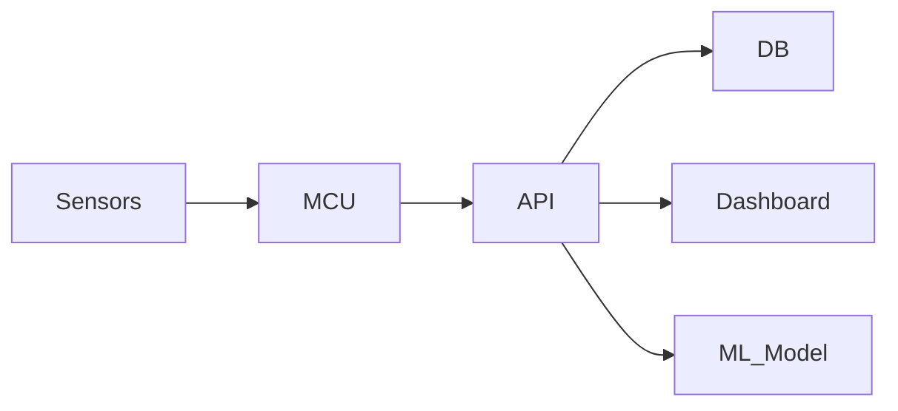

# Ubaid Patel

Full-Stack Engineer • Embedded Systems • Machine Learning

---

## Engineering Focus

I design and build end-to-end systems that connect:

Hardware → Communication → Backend Infrastructure → Data Processing → User Interface

My work centers on architectural clarity, system reliability, and practical deployment.

---

## Core Competence

**Languages**  
JavaScript • TypeScript • Python • Java • C++ • SQL  

**Backend Engineering**  
Node.js • Express • FastAPI  
REST Architecture • Authentication • Modular Design • Real-Time Systems  

**Frontend Engineering**  
React • Next.js • Structured Component Design • API Integration  

**Databases**  
MongoDB • MySQL • Redis • Schema Optimization  

**Embedded Systems**  
Microcontroller Integration • Real-Time Logic • Communication Protocols  

**Machine Learning**  
Model Integration • Inference Pipelines • Applied ML Systems  

---

## Selected Systems

### Yield  
Autonomous IoT agricultural system integrating distributed sensing, backend orchestration, and intelligent control logic.

Designed with modular services, structured device communication handling, and prediction-assisted decision flow.

#### Architecture Overview

---

### GeoTrack  
LoRa-based vehicle tracking architecture combining embedded communication with structured backend processing and visualization layers.

Emphasis on reliable device-to-server data flow and separation between networking, processing, and presentation layers.

---

### PrimeShop  
Full-stack commerce platform built around secure REST APIs, database-optimized operations, and clean separation of business logic from UI layers.

---

## Engineering Direction

Distributed Systems • Scalable Backend Design • Embedded Intelligence • ML Deployment Pipelines • Performance-Oriented Architecture

---

## Activity Snapshot

  
  

---

Engineering systems from silicon to scalable software.
